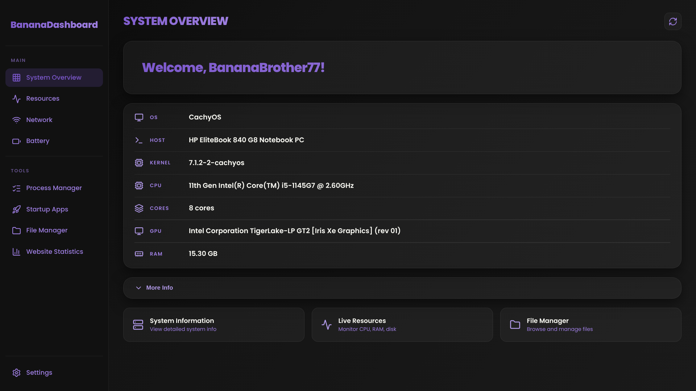

# BananaDashboard



A desktop system dashboard built with Electron. Think of it like a server dashboard (Pterodactyl, Cockpit) but for your local Linux machine. Works on Windows and macOS too.

## Features

- **Overview** -- System info at a glance: OS, kernel, CPU, RAM, GPU, uptime, plus a collapsible More Info panel (shell, DE, terminal, packages, local IP, battery, swap)
- **Resources** -- Live CPU, RAM, GPU, and disk usage graphs with configurable refresh rate; per-partition disk breakdown; app resource usage (PID, memory, heap)
- **Network** -- Live download/upload rates, IPv4/IPv6, MAC address, gateway, latency, and per-interface cards with link speed and status
- **Battery** -- Charge percentage, status, and time remaining (or time to full while charging)
- **Theme system** -- Six color themes (purple, green, red, yellow, blue, pink) that persist across sessions
- **Multi-language** -- English and German UI, switchable on the fly
- **Privacy mode** -- Hide sensitive values (IP addresses, MAC) until you click them
- **Customization** -- Right-click sidebar tabs to rename or hide them, double-click section labels to rename, right-click panels to hide. Restore everything from Settings
- **Performance** -- Disable UI animations for a snappier UI and unload hidden website tabs so they don't keep running in the background
- **Discord Rich Presence** -- Shows your current tab and system status in Discord
- **Auto-updates** -- Checks for new versions on startup, manual download flow with progress bar
- **Settings** -- Searchable settings grouped by category (appearance, system, performance, updates, Discord RPC) covering theme, language, refresh rates, privacy, start-maximized, and hidden tab/element management with one-click reset
- **Webview tabs** -- Embedded MCToolkit, MCServerHost, MCSH Tools, and Website Statistics panels with fullscreen mode
- **Sidebar collapse** -- Click the edge bar or press Ctrl+B to collapse the sidebar for more content space
- **Loading screen** -- Animated splash with logo and spinner while system info loads

## Tech Stack

- **Runtime**: Node.js (latest LTS)
- **Desktop**: Electron 43+
- **Frontend**: Vanilla HTML, CSS, JavaScript (no frameworks, no bundler)
- **System data**: `systeminformation` in the main process (plus `nvidia-smi` / `rocm-smi` / Intel sysfs fallback for GPU, `df`/`wmic` for disk)
- **Updates**: `electron-updater`
- **Charts**: Chart.js 4.x via CDN
- **Icons**: Lucide via CDN
- **Font**: Poppins (served from the BananaBrother77 global-assets repo)

## Installation

BananaDashboard is a packaged desktop app. You don't need to build anything to use it.

### Download a binary

Grab the installer for your platform from the [Releases page](https://github.com/BananaBrother77/BananaDashboard/releases):

- **Linux** -- `.AppImage` (portable, runs on any distro), `.deb` (Debian/Ubuntu), `.pacman` (Arch)
- **Windows** -- NSIS installer (`.exe`)
- **macOS** -- `.dmg`

Install the pacman package:

```bash
sudo pacman -U dist/bananadashboard-*.pacman
```

### AUR (Arch Linux)

```bash
yay -S bananadashboard-bin
# or: paru -S bananadashboard-bin
```

## Development

Run the app from source. Requires **Node.js (latest LTS)** and **npm**.

```bash
git clone https://github.com/BananaBrother77/BananaDashboard.git
cd BananaDashboard
npm install
npm start
```

The app starts with an auto-hidden menu bar (press Alt to show it). Tab shortcuts: 1-9 on your keyboard. Press Ctrl+B to collapse the sidebar.

## Building

Build installers for your platform into `dist/`:

```bash
npm run build -- --linux   # .AppImage, .deb, .pacman
npm run build -- --mac     # .dmg
npm run build -- --win     # NSIS installer (.exe)
```

## Auto-Updates

The app uses `electron-updater` to check for new versions from GitHub Releases on startup. When an update is available:

1. A status bar shows "Update available (vX.X.X)"
2. Click **Download Update** to download in the background
3. Once downloaded, the button changes to **Restart & Install**
4. Click to restart and apply the update

You can also manually check from **Settings > Updates > Check for Updates**.

> **Note for AUR users:** the built-in auto-updater is skipped for AUR installs. Update via your package manager instead (`yay -S bananadashboard-bin` or `paru -S bananadashboard-bin`).

## CI / Releases

Pushing a tag matching `v*` triggers a GitHub Actions workflow that:

1. Builds Linux (AppImage, deb, pacman), Windows (NSIS), and macOS (DMG) packages
2. Creates a GitHub Release with the binaries and auto-generated notes
3. Posts a notification to Discord
4. Publishes a new `bananadashboard-bin` version to the AUR

```bash
git tag -a v1.0.0 -m "Release v1.0.0"   # annotated tags recommended
git push origin v1.0.0
```

## Discord Rich Presence

BananaDashboard can show your current tab and activity in your Discord status. Enable/disable it from **Settings > Discord Rich Presence**.

If Discord is running, the app connects automatically and updates presence every 15 seconds with per-tab descriptions (e.g., "Monitoring system resources", "Browsing files").

## Project Structure

```
BananaDashboard/
├── meow.js                    # Electron main process (window, IPC, system info, updater, menu)
├── preload.js                 # Context bridge (window.dashboardAPI)
├── src/
│   ├── index.html             # App shell
│   └── assets/
│       ├── css/
│       │   ├── style.css      # Design system (layout, sidebar, themes, reveal animations)
│       │   ├── overview.css   # Overview tab styles
│       │   ├── resources.css  # Resources tab styles (charts, disk)
│       │   ├── network.css    # Network tab styles
│       │   ├── battery.css    # Battery tab styles
│       │   ├── privacy.css    # Privacy mode styles
│       │   └── settings.css   # Settings tab styles
│       └── js/
│           ├── app.js         # Shared element refs, tab switching, IPC calls
│           ├── translations.js# i18n (en/de)
│           ├── reveal.js      # Scroll-in reveal animations
│           └── modules/
│               ├── resources.js # Live resource monitoring (Chart.js)
│               ├── network.js   # Network stats polling + interface cards
│               ├── battery.js   # Battery polling
│               ├── overview.js  # Overview + More Info panel
│               ├── refresh.js   # Per-module refresh rate system
│               ├── animations.js# Disable UI animations toggle
│               ├── privacy.js   # Privacy mode toggle
│               ├── fullscreen.js# Start-maximized toggle
│               ├── sidebar.js   # Sidebar collapse + section rename
│               ├── context-menu.js # Right-click rename/hide tabs & panels
│               ├── webview.js   # Webview fullscreen + refresh button
│               ├── settings.js  # Settings categories, search, toggles
│               ├── updater.js   # Update status UI
│               ├── rpc.js       # Discord RPC status UI
│               └── discord.js   # Discord RPC via raw IPC socket (main process)
├── .github/workflows/release.yml  # CI build + release + AUR publish
├── package.json
└── README.md
```

## Security

- `contextIsolation: true`, `nodeIntegration: false`
- All Node.js communication goes through the preload context bridge
- No `remote` module usage
- Content-Security-Policy is not set (local-only app)

## Architecture

The renderer communicates with the main process exclusively through `window.dashboardAPI`, which is exposed via `contextBridge` in `preload.js`. Each API method maps to an IPC channel. The main process handles all native system operations (os, child_process, fs).

## License

ISC
